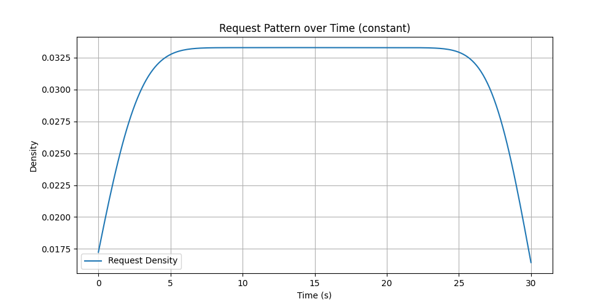
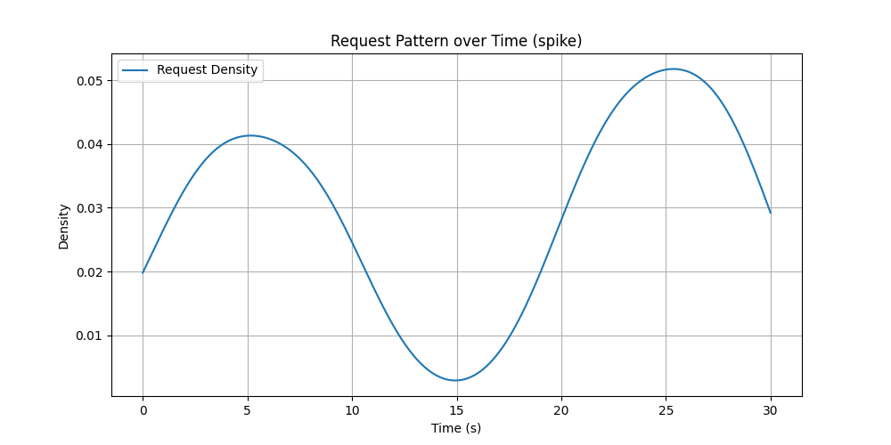
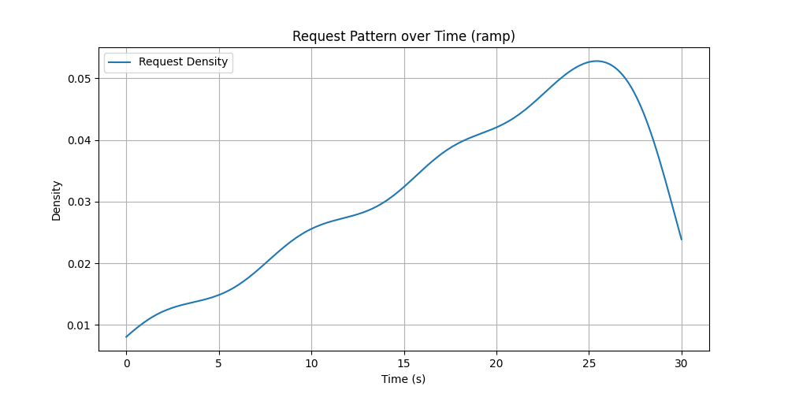
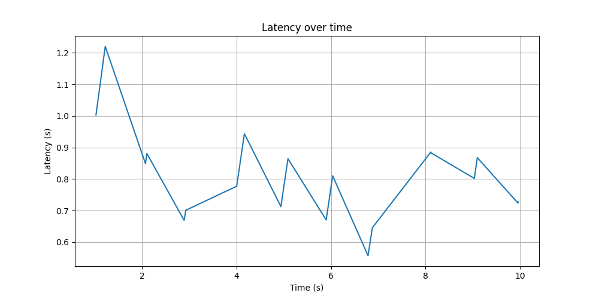
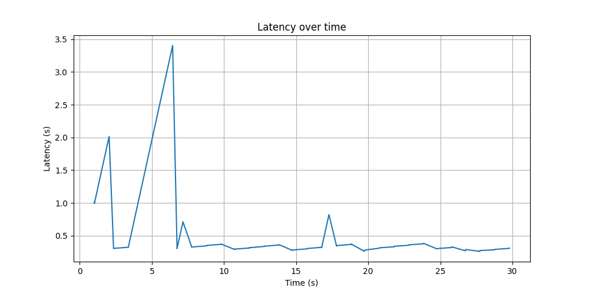

# HTTP Load Tester

This Python-based tool is designed for HTTP load testing and benchmarking. It can simulate a specified rate of HTTP requests to a target URL and provides detailed statistics on performance and response times. The tool supports both GET and POST requests, configurable through command-line arguments. 

Example use cases for POST request with GPT 3.5 inference and GET request with a dummy load website is shown!

## Features

### Bare Minimum Requirements

- **HTTP Address Input**: Accepts an HTTP address to target the server.
- **Configurable Queries Per Second (QPS)**: Supports a `--qps` flag to generate requests at a specified fixed QPS.
- **Latency and Error Reporting**: Reports comprehensive latencies and error rates.
- **Docker Image**: Provides a buildable Docker image for convenient deployment and scalability.

### Additional Features Added

1) **Concurrent Users**: Allows the simulation of multiple users hitting the server simultaneously. This feature is crucial for testing how well the server handles simultaneous load, mimicking real-world usage by multiple users.

2) **Request Send Patterns**: Choose from several predefined request sending patterns to simulate different real-world traffic scenarios:
    
   - **Constant Rate**: Maintains a steady flow of requests per second throughout the test duration. Ideal for testing baseline performance under a continuous load.
   
   - **Spiky Rates**: Introduces sudden bursts of high traffic at intervals. This pattern is useful for testing how the server handles unexpected spikes in user activity.
   
   - **Ramping Up Rate**: Gradually increases the rate of requests over time. This helps in assessing server performance as load intensifies.
   
   After the load test, patterns of request sending are visualized to analyze the impact of these traffic patterns on server behavior as shown above. The images above are plots generated after load testing with those patterns chosen.

3) **Support for GET and POST Requests**: Enables the tool to send both GET and POST requests, allowing for a wider range of testing scenarios. This feature is important for applications that rely on data retrieval as well as data submission functionalities.

4) **Detailed Statistics and Plots**: Provides extensive reporting features including:
   - **Error Tracking**: Tracks and reports errors during the test, identifying potential failure points or bugs in the application.
   - **Latency Statistics**: Captures detailed latency statistics such as minimum, maximum, mean, median, and various percentiles to give a comprehensive view of the server's response times.
   - **Status Code Distribution**: Reports on the distribution of HTTP response status codes, which helps in understanding the different types of responses sent by the server under load.
   - **Visual Latency Plots**: Generates visual plots of latency over time, saved as image files. These plots are invaluable for visual analysis of the server’s performance trends during the test.

5) **Additional Parameters for Quality of Life**:
   - **Duration**: Set the duration of the test to measure sustained load performance.
   - **Timeout**: Set a timeout for each request to simulate network and server delays.

## Installation

Ensure you have Docker installed on your machine as the application is containerized. First, build the Docker image for the HTTP Load Tester. Navigate to the directory containing the Dockerfile and run the following command:

```bash
docker build -t loadtester .
```

This command builds the Docker image tagged as `loadtester`, and it automatically installs all necessary Python packages as specified in the `requirements.txt` file during the build process.

## Source Code

The source code for the load testing tool is organized into three files within the src directory:

**load_tester.py**: This is the main script that contains the HTTPLoadTester class. It orchestrates the load testing process, including setting up the test environment, executing the HTTP requests based on the specified patterns, and handling the results.

**request_patterns.py**: This file defines various request sending patterns such as constant rate, spikes, and ramps. These functions are used by the main script to simulate different types of load on the target server.

**test_load_tester.py**: Contains unit tests for the HTTPLoadTester class. This file is used to ensure that the functionalities of the load tester are working as expected and to prevent regressions in future code changes.

## Usage

Run the tool from the command line using Docker by specifying the target URL and other parameters. Here's how you can run the container with the necessary arguments:

```bash
./run_loadtester.sh [URL] --qps [QPS] --concurrency [Concurrency] --duration [Duration] --headers '{"Header1":"Value1", "Header2":"Value2"}' --payload '{"key":"value"}' --timeout [Timeout] --pattern [Pattern]
```

### Parameters

- `url`: The target URL for the load test.
- `--qps` (optional): The number of queries per second. Default is 10.
- `--concurrency` (optional): The number of concurrent users. Default is 10.
- `--duration` (optional): Duration of the test in seconds. Default is 60.
- `--headers` (optional): JSON string of headers to include in the requests.
- `--payload` (optional): JSON string of the payload for POST requests.
- `--timeout` (optional): Timeout for each request in seconds. Default is 30.
- `--pattern` (optional): Pattern of request sending, can be 'constant', 'spike', or 'ramp'. Default is 'constant'.

## Output

After running the test, the tool outputs:

- Total number of requests made.
- Number of errors encountered.
- Error rate.
- Actual QPS achieved.
- Detailed latency statistics.
- Status code distribution.
- A plot image (`Latency_Plots/latency_plot<num>.png`) showing latency over time.

## Example Use Case 1: POST

### Sending requests using OpenAI API's Chat Completion to their GPT-3.5 Turbo Model (LLM Inference!)

Note: Be careful running this use case, as it could charge you money from your OpenAI account 🙁

Command Used: 
```bash
./run_loadtester.sh https://api.openai.com/v1/chat/completions \
    --qps 3 \
    --concurrency 2 \
    --duration 10 \
    --headers '{"Authorization": "Bearer <Your OpenAI API Key>"}' \
    --payload '{"model": "gpt-3.5-turbo", "messages": [{"role": "user", "content": "Reply in one word: Hello"}]}' \
    --timeout 60 
```
**P.S.** The responses were pretty much all "Hi" or "Hi!" from ChatGPT 3.5...



**Test Results:**
- Total Requests: 27
- Errors: 0
- Error Rate: 0.00%
- Actual QPS: 2.70

**Latency Statistics (seconds):**
- Min: 0.2632
- Max: 2.0606
- Mean: 0.5106
- Median: 0.3187
- P90: 2.0325
- P95: 2.0332
- P99: 2.0606
- Std Dev: 0.5533

**Status Code Distribution:**
- 200: 27


## Example Use Case 2: GET

### Sending requests to a Dummy Load Testing Webpage

Command Used: 
```bash
./run_loadtester.sh https://test.k6.io/contacts.php --qps 5 --concurrency 5 --duration 30 --timeout 10
```



**Test Results:**
- Total Requests: 135
- Errors: 0
- Error Rate: 0.00%
- Actual QPS: 4.50

**Latency Statistics (seconds):**
- Min: 0.2621
- Max: 3.4015
- Mean: 0.3839
- Median: 0.3251
- P90: 0.3750
- P95: 0.8225
- P99: 2.0146
- Std Dev: 0.3262

**Status Code Distribution:**
- 200: 135
  


## Next Steps
- **User coded request pattern:** the user can already choose from three pre-set request patterns in the current implementation. It will be not very difficult to extend the feature to allow the user to create their own request pattern.
- **Allowing load testing from specified regions or a combination of regions** seemed really complicated to do so I did not do it in this implementation.
- **Reading the responses from POST requests** can add a new dimension of load testing. Instead of just checking whether it was received by the server, it would be cool to also see whether high load causes the server to return faulty answers. This will only work if we know what the response to each POST is supposed to be.
- **Frontend UI** would be nice.
